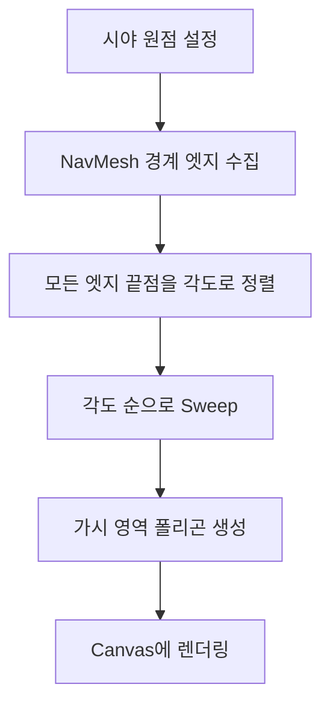

# NavMesh 기반 Visibility Polygon 설계

## 개요

현재 레이캐스트 기반 시야 시스템을 NavMesh 엣지 기반으로 대체하여 성능과 정확도 개선.

## 현재 방식 vs 제안 방식

| 항목 | 현재 (레이캐스트) | 제안 (NavMesh) |
|------|------------------|----------------|
| 복잡도 | O(rays × objects) | O(edges log edges) |
| 정확도 | 샘플 수에 의존 | 수학적으로 정확 |
| 블러 필요 | 필수 (계단 현상) | 선택 (자연스러운 폴리곤) |

## 알고리즘: Angular Sweep



### 핵심 단계

1. **경계 엣지 추출**: NavMesh에서 벽과 접한 엣지만 필터링
2. **각도 정렬**: 시야 원점 기준으로 모든 끝점을 각도 순 정렬
3. **Sweep**: 정렬된 순서로 순회하며 현재 가시 엣지 추적
4. **폴리곤 생성**: Sweep 결과로 visibility polygon 구성

## 구현 구조

### 새 클래스

```
UNavMeshVisibilityComponent
├── CollectBoundaryEdges()     // NavMesh 경계 엣지 수집
├── ComputeVisibilityPolygon() // Angular Sweep 알고리즘
└── GetVisibilityVertices()    // 결과 폴리곤 버텍스
```

### 파일 구조

```
MiyakovVisionSystem/
├── Public/
│   ├── NavMeshVisibilityComponent.h  [NEW]
│   └── VisibilityPolygonAlgorithm.h  [NEW]
└── Private/
    ├── NavMeshVisibilityComponent.cpp [NEW]
    └── VisibilityPolygonAlgorithm.cpp [NEW]
```

## NavMesh 접근 코드

```cpp
// 경계 엣지 수집
void CollectBoundaryEdges(const FVector& Origin, float MaxDistance)
{
    UNavigationSystemV1* NavSys = FNavigationSystem::GetCurrent<UNavigationSystemV1>(World);
    ARecastNavMesh* NavMesh = Cast<ARecastNavMesh>(NavSys->GetDefaultNavDataInstance());
    
    const dtNavMesh* DetourMesh = NavMesh->GetRecastMesh();
    
    for (int32 TileIdx = 0; TileIdx < DetourMesh->getMaxTiles(); ++TileIdx)
    {
        const dtMeshTile* Tile = DetourMesh->getTile(TileIdx);
        for (int32 PolyIdx = 0; PolyIdx < Tile->header->polyCount; ++PolyIdx)
        {
            const dtPoly* Poly = &Tile->polys[PolyIdx];
            
            // 경계 엣지만 추출 (이웃 폴리곤이 없는 엣지)
            for (int32 i = 0; i < Poly->vertCount; ++i)
            {
                if (Poly->neis[i] == 0) // 경계 엣지
                {
                    // 엣지 버텍스 저장
                    FVector V0 = GetVertexPosition(Tile, Poly->verts[i]);
                    FVector V1 = GetVertexPosition(Tile, Poly->verts[(i+1) % Poly->vertCount]);
                    BoundaryEdges.Add(FEdge(V0, V1));
                }
            }
        }
    }
}
```

## Angular Sweep 알고리즘

```cpp
struct FAngleEvent
{
    float Angle;
    int32 EdgeIndex;
    bool bIsStart; // 시작점 or 끝점
};

TArray<FVector2D> ComputeVisibilityPolygon(const FVector2D& Origin)
{
    // 1. 이벤트 생성 및 정렬
    TArray<FAngleEvent> Events;
    for (int32 i = 0; i < Edges.Num(); ++i)
    {
        float Angle0 = FMath::Atan2(Edges[i].V0.Y - Origin.Y, Edges[i].V0.X - Origin.X);
        float Angle1 = FMath::Atan2(Edges[i].V1.Y - Origin.Y, Edges[i].V1.X - Origin.X);
        
        Events.Add({Angle0, i, true});
        Events.Add({Angle1, i, false});
    }
    Events.Sort([](const FAngleEvent& A, const FAngleEvent& B) { return A.Angle < B.Angle; });
    
    // 2. Sweep (활성 엣지 집합 유지)
    TSet<int32> ActiveEdges;
    TArray<FVector2D> VisibilityPolygon;
    
    for (const FAngleEvent& Event : Events)
    {
        if (Event.bIsStart)
            ActiveEdges.Add(Event.EdgeIndex);
        else
            ActiveEdges.Remove(Event.EdgeIndex);
        
        // 현재 각도에서 가장 가까운 엣지와의 교점
        FVector2D IntersectionPoint = FindClosestIntersection(Origin, Event.Angle, ActiveEdges);
        VisibilityPolygon.Add(IntersectionPoint);
    }
    
    return VisibilityPolygon;
}
```

## Build.cs 수정

```csharp
PublicDependencyModuleNames.AddRange(new string[] {
    "Core",
    "CoreUObject",
    "Engine",
    "NavigationSystem",  // [NEW]
    "Navmesh"            // [NEW] Detour 접근용
});
```

## 장점

- **정확한 폴리곤**: 블러 없이도 매끄러운 시야 경계
- **성능**: 엣지 수에만 비례 (레이 수와 무관)
- **동적 장애물**: NavMesh Modifier로 런타임 업데이트 가능

## 고려사항

- NavMesh 생성 필요 (레벨에 NavMeshBoundsVolume)
- 수직 장애물 (낮은 벽) 처리 추가 로직 필요
- 실시간 NavMesh 업데이트 비용
