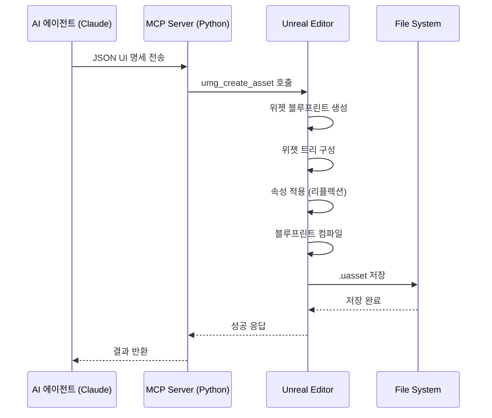

# UMG MCP Asset Generator System
## 기술 설계 문서 v1.0

---

## 문서 정보

| 항목 | 내용 |
|------|------|
| **문서 버전** | 1.0 |
| **작성일** | 2024-12-29 |
| **대상 엔진** | Unreal Engine 5.3+ |
| **대상 플랫폼** | Windows (Editor Only) |
| **라이선스** | MIT |

---

## 1. 프로젝트 개요

### 1.1 목적

UMG MCP Asset Generator System은 **AI 에이전트가 MCP(Model Context Protocol)를 통해 언리얼 에디터에 접속**하여, JSON 명세를 기반으로 **실제 위젯 블루프린트(.uasset)를 생성, 편집, 저장**할 수 있도록 지원하는 에디터 확장 시스템입니다.

> **핵심 가치**: AI가 UI 레이아웃을 제안하고, 이를 즉시 프로젝트의 Content 폴더에 `.uasset` 형태로 물리적으로 저장하여 UI 프로토타이핑 속도를 혁신합니다.

### 1.2 핵심 차별점

| 구분 | 기존 방식 | UMG MCP 방식 |
|------|----------|--------------|
| **생성 시점** | 런타임(In-Game) | 에디터 타임(Editor-Time) |
| **결과물** | 임시 위젯 객체 | 영구 저장 .uasset 파일 |
| **AI 연동** | 불가능 | MCP 프로토콜 지원 |
| **협업** | 수동 작업 필요 | 자동화 파이프라인 |

### 1.3 주요 사용 시나리오

---

## 2. 문서 구성

본 설계 문서는 다음과 같이 기능별로 분할되어 있습니다:

| 번호 | 파일명 | 설명 |
|------|--------|------|
| 00 | `00_Overview.md` | 프로젝트 개요 및 문서 구성 (현재 문서) |
| 01 | `01_SystemRequirements.md` | 시스템 요구사항 및 기능 명세 |
| 02 | `02_Architecture.md` | 시스템 아키텍처 및 모듈 구조 |
| 03 | `03_ClassDesign.md` | 클래스 설계 및 다이어그램 |
| 04 | `04_JSONSchema.md` | JSON 명세 및 스키마 정의 |
| 05 | `05_WidgetTreeBuilder.md` | 위젯 트리 빌더 상세 설계 |
| 06 | `06_PropertyReflection.md` | 속성 리플렉션 시스템 |
| 07 | `07_SlotSystem.md` | 슬롯 시스템 처리 |
| 08 | `08_AssetManagement.md` | 에셋 생성/저장 관리 |
| 09 | `09_MCPIntegration.md` | MCP 연동 및 Python 도구 |
| 10 | `10_Implementation.md` | 구현 가이드 및 예제 코드 |

---

## 3. 기술 스택

### 3.1 언리얼 엔진 측

| 구성 요소 | 기술/모듈 |
|----------|----------|
| **기반 클래스** | `UEditorSubsystem` |
| **필수 모듈** | `UnrealEd`, `UMG`, `UMGEditor`, `Slate`, `SlateCore` |
| **에셋 생성** | `UWidgetBlueprintFactory` |
| **컴파일** | `FKismetEditorUtilities::CompileBlueprint` |
| **리플렉션** | `FProperty`, `UObject::StaticClass()` |
| **빌드 조건** | `WITH_EDITOR` 매크로 필수 |

### 3.2 Python MCP 측

| 구성 요소 | 기술/라이브러리 |
|----------|----------------|
| **프로토콜** | Model Context Protocol (MCP) |
| **데이터 검증** | Pydantic v2 |
| **통신** | JSON-RPC over stdio/SSE |
| **SDK** | mcp-python-sdk |

### 3.3 지원 위젯 타입

#### 컨테이너 위젯
- `CanvasPanel` - 절대 좌표 기반 배치
- `VerticalBox` - 수직 정렬 컨테이너
- `HorizontalBox` - 수평 정렬 컨테이너
- `GridPanel` - 그리드 기반 배치
- `Overlay` - 오버레이 스택 배치
- `SizeBox` - 크기 제약 컨테이너
- `ScaleBox` - 스케일링 컨테이너
- `ScrollBox` - 스크롤 가능 컨테이너

#### 기본 위젯
- `TextBlock` - 텍스트 표시
- `Image` - 이미지 표시
- `Button` - 버튼 (자식 포함 가능)
- `Border` - 테두리/배경
- `ProgressBar` - 진행률 표시
- `Slider` - 슬라이더
- `CheckBox` - 체크박스
- `EditableText` - 편집 가능 텍스트
- `Spacer` - 공간 확보

---

## 4. 용어 정의

| 용어 | 정의 |
|------|------|
| **MCP** | Model Context Protocol - AI 에이전트와 외부 시스템 간의 통신 프로토콜 |
| **UMG** | Unreal Motion Graphics - 언리얼 엔진의 UI 시스템 |
| **Widget Blueprint** | .uasset 형태로 저장되는 UMG 위젯 클래스 |
| **Slot** | 부모 위젯이 자식에게 제공하는 레이아웃 정보 컨테이너 |
| **Editor Subsystem** | 에디터 전용 싱글톤 서브시스템 |
| **Reflection** | UObject 프로퍼티에 동적으로 접근하는 메커니즘 |

---

## 5. 제약 사항 및 한계

### 5.1 기술적 제약

| 제약 사항 | 설명 | 우회 방안 |
|----------|------|----------|
| **에디터 전용** | 런타임/패키지 빌드에서 동작 불가 | Editor 모듈로 분리 |
| **이벤트 바인딩** | 블루프린트 그래프 노드 생성 복잡 | Base Class 상속 방식 |
| **애니메이션** | UMG 애니메이션 자동 생성 미지원 | 사전 정의된 애니메이션 참조 |
| **동적 데이터 바인딩** | ViewModel 자동 생성 미지원 | 수동 바인딩 또는 Base Class |

### 5.2 지원하지 않는 기능

- 블루프린트 이벤트 그래프 자동 생성
- UMG 애니메이션 시퀀스 생성
- 머티리얼 인스턴스 동적 생성
- 커스텀 위젯 클래스 생성 (기존 위젯만 조합)

---

## 6. 버전 히스토리

| 버전 | 날짜 | 변경 내용 | 작성자 |
|------|------|----------|--------|
| 1.0 | 2024-12-29 | 초기 설계 문서 작성 | AI Architect |

---

## 7. 참고 자료

- [Unreal Engine UMG Documentation](https://docs.unrealengine.com/5.3/en-US/umg-ui-designer-for-unreal-engine/)
- [Model Context Protocol Specification](https://github.com/anthropics/model-context-protocol)
- [Unreal Editor Subsystem Documentation](https://docs.unrealengine.com/5.3/en-US/API/Editor/UnrealEd/Subsystems/)
- [UWidgetBlueprint API Reference](https://docs.unrealengine.com/5.3/en-US/API/Editor/UMGEditor/UWidgetBlueprint/)
