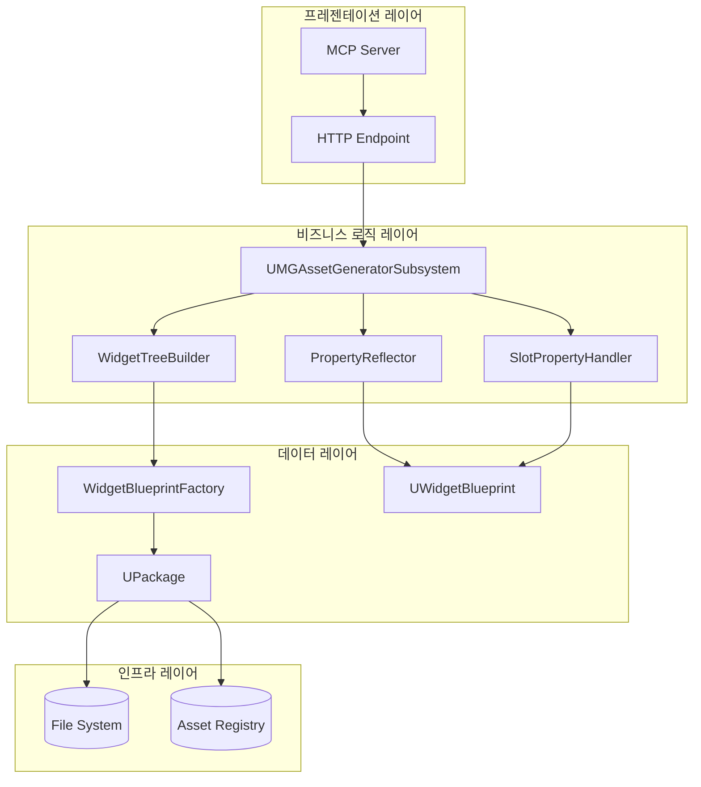
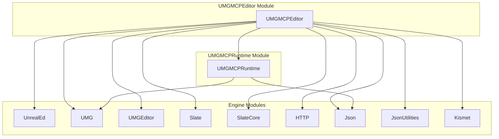
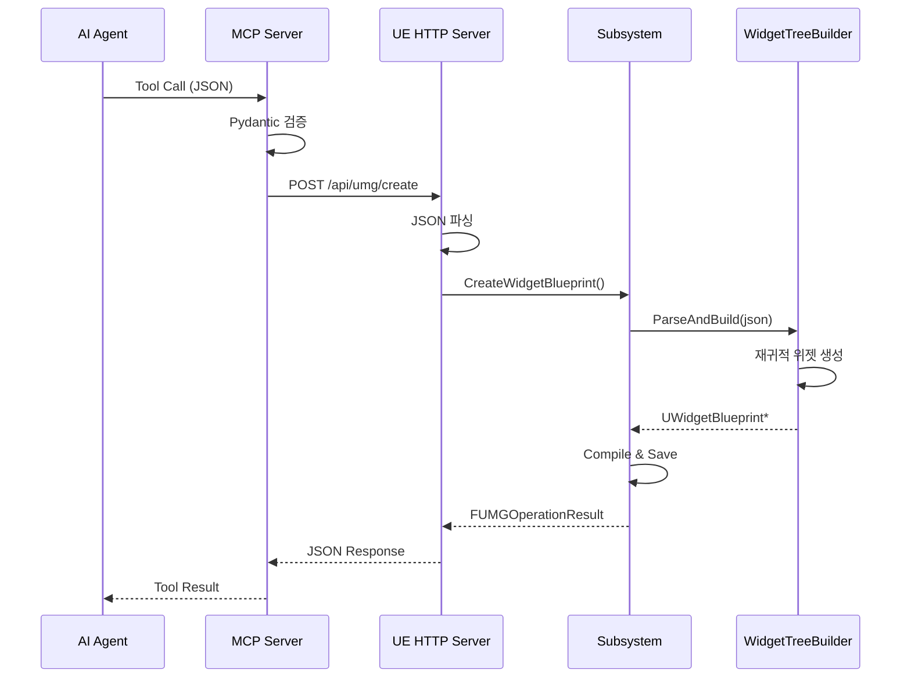
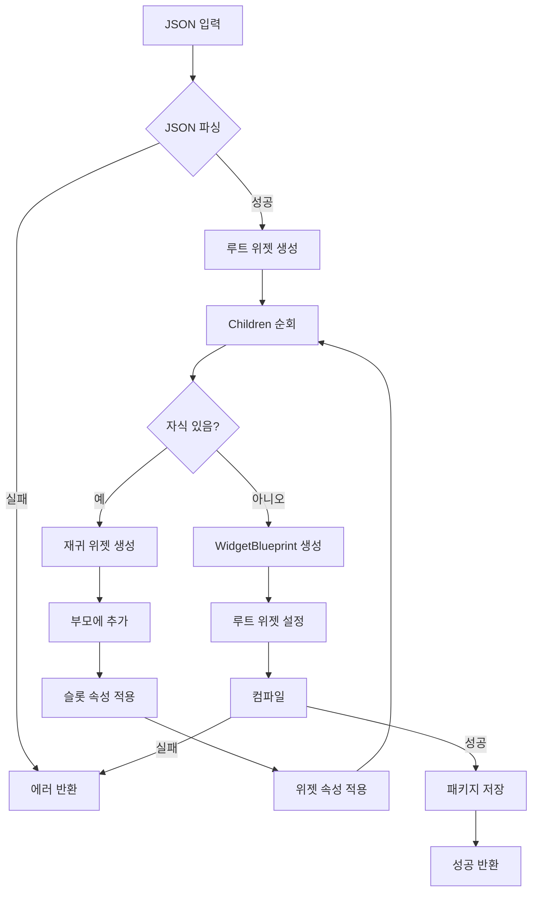
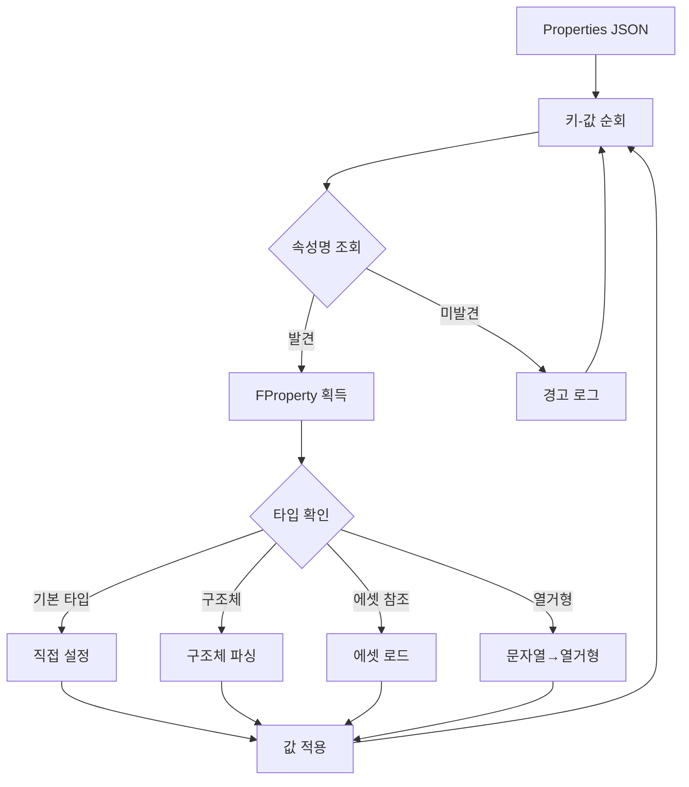
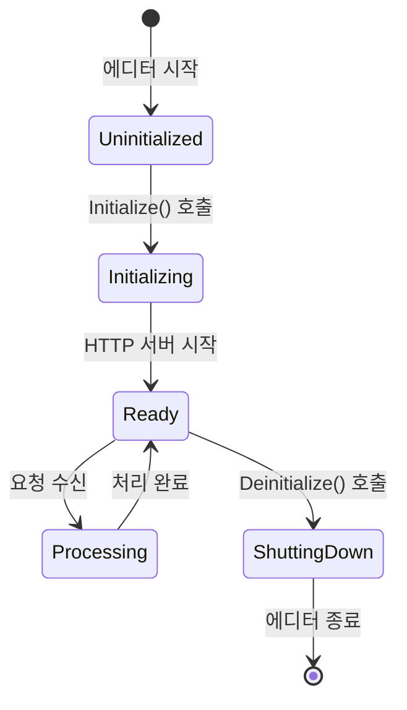
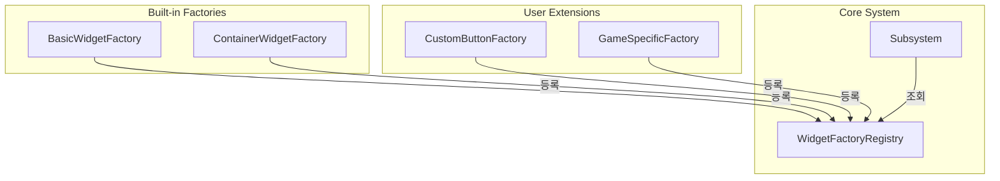

# 02. 시스템 아키텍처
## UMG MCP Asset Generator System

---

## 1. 아키텍처 개요

### 1.1 시스템 구성도

```
┌─────────────────────────────────────────────────────────────────────┐
│                         AI 에이전트 (Claude)                          │
│  ┌─────────────────────────────────────────────────────────────┐    │
│  │  - UI 레이아웃 분석                                           │    │
│  │  - JSON 명세 생성                                            │    │
│  │  - 위젯 구조 최적화 제안                                       │    │
│  └─────────────────────────────────────────────────────────────┘    │
└──────────────────────────────┬──────────────────────────────────────┘
                               │ MCP Protocol (JSON-RPC)
                               ▼
┌─────────────────────────────────────────────────────────────────────┐
│                      MCP Server (Python)                             │
│  ┌──────────────┐  ┌──────────────┐  ┌──────────────┐               │
│  │ Tool Handler │  │   Pydantic   │  │    UE RPC    │               │
│  │              │  │  Validator   │  │    Client    │               │
│  └──────────────┘  └──────────────┘  └──────────────┘               │
└──────────────────────────────┬──────────────────────────────────────┘
                               │ HTTP/WebSocket (JSON)
                               ▼
┌─────────────────────────────────────────────────────────────────────┐
│                    Unreal Editor (C++)                               │
│  ┌─────────────────────────────────────────────────────────────┐    │
│  │              UMG MCP Editor Module                           │    │
│  │  ┌─────────────────┐  ┌────────────────────────────────┐    │    │
│  │  │   HTTP Server   │  │  UUMGAssetGeneratorSubsystem   │    │    │
│  │  │   (Endpoint)    │──│  ├─ CreateWidgetBlueprint()    │    │    │
│  │  └─────────────────┘  │  ├─ AddWidget()                │    │    │
│  │                       │  ├─ ModifyWidget()             │    │    │
│  │                       │  ├─ SaveAsset()                │    │    │
│  │                       │  └─ GetWidgetTree()            │    │    │
│  │                       └────────────────────────────────┘    │    │
│  │                                      │                       │    │
│  │                       ┌──────────────┴──────────────┐       │    │
│  │                       ▼                              ▼       │    │
│  │  ┌─────────────────────────┐  ┌─────────────────────────┐   │    │
│  │  │  UWidgetTreeBuilder    │  │  UPropertyReflector     │   │    │
│  │  │  ├─ ParseJson()        │  │  ├─ ApplyProperties()   │   │    │
│  │  │  ├─ CreateWidget()     │  │  ├─ GetPropertyType()   │   │    │
│  │  │  └─ BuildHierarchy()   │  │  └─ ConvertValue()      │   │    │
│  │  └─────────────────────────┘  └─────────────────────────┘   │    │
│  │                       │                              │       │    │
│  │                       └──────────────┬───────────────┘       │    │
│  │                                      ▼                       │    │
│  │                       ┌─────────────────────────────┐       │    │
│  │                       │  USlotPropertyHandler      │       │    │
│  │                       │  ├─ DetectSlotType()       │       │    │
│  │                       │  └─ ApplySlotProperties()  │       │    │
│  │                       └─────────────────────────────┘       │    │
│  └─────────────────────────────────────────────────────────────┘    │
│                                      │                               │
│                       ┌──────────────┴──────────────┐               │
│                       ▼                              ▼               │
│  ┌─────────────────────────┐       ┌─────────────────────────┐      │
│  │  UWidgetBlueprintFactory│       │  FKismetEditorUtilities │      │
│  │  (에셋 생성)             │       │  (블루프린트 컴파일)      │      │
│  └─────────────────────────┘       └─────────────────────────┘      │
│                       │                              │               │
│                       └──────────────┬───────────────┘               │
│                                      ▼                               │
│                       ┌─────────────────────────────┐               │
│                       │     File System             │               │
│                       │     (.uasset 저장)          │               │
│                       └─────────────────────────────┘               │
└─────────────────────────────────────────────────────────────────────┘
```

### 1.2 레이어 아키텍처



---

## 2. 모듈 구조

### 2.1 플러그인 구조

```
UMGMCP/
├── UMGMCP.uplugin
├── Source/
│   ├── UMGMCPRuntime/           # 런타임 모듈 (최소한의 공유 타입)
│   │   ├── UMGMCPRuntime.Build.cs
│   │   ├── Public/
│   │   │   └── UMGMCPTypes.h    # 공유 타입 정의
│   │   └── Private/
│   │       └── UMGMCPRuntimeModule.cpp
│   │
│   └── UMGMCPEditor/            # 에디터 모듈 (핵심 기능)
│       ├── UMGMCPEditor.Build.cs
│       ├── Public/
│       │   ├── UMGAssetGeneratorSubsystem.h
│       │   ├── WidgetTreeBuilder.h
│       │   ├── PropertyReflector.h
│       │   ├── SlotPropertyHandler.h
│       │   └── UMGMCPHttpServer.h
│       └── Private/
│           ├── UMGMCPEditorModule.cpp
│           ├── UMGAssetGeneratorSubsystem.cpp
│           ├── WidgetTreeBuilder.cpp
│           ├── PropertyReflector.cpp
│           ├── SlotPropertyHandler.cpp
│           └── UMGMCPHttpServer.cpp
│
├── Content/                      # 기본 에셋
│   └── Templates/
│       └── BaseUserWidget.uasset
│
├── Python/                       # MCP 서버
│   ├── requirements.txt
│   ├── umg_mcp_server/
│   │   ├── __init__.py
│   │   ├── server.py
│   │   ├── tools.py
│   │   ├── models.py
│   │   └── ue_client.py
│   └── tests/
│
└── Docs/                         # 문서
    ├── 00_Overview.md
    ├── 01_SystemRequirements.md
    └── ...
```

### 2.2 모듈 의존성



### 2.3 Build.cs 설정

```csharp
// UMGMCPEditor.Build.cs
using UnrealBuildTool;

public class UMGMCPEditor : ModuleRules
{
    public UMGMCPEditor(ReadOnlyTargetRules Target) : base(Target)
    {
        PCHUsage = PCHUsageMode.UseExplicitOrSharedPCHs;

        // 에디터 전용 모듈
        if (Target.bBuildEditor)
        {
            PublicDependencyModuleNames.AddRange(new string[]
            {
                "Core",
                "CoreUObject",
                "Engine",
                "UMG",
                "Slate",
                "SlateCore",
                "UMGMCPRuntime"
            });

            PrivateDependencyModuleNames.AddRange(new string[]
            {
                "UnrealEd",
                "UMGEditor",
                "Kismet",
                "BlueprintGraph",
                "HTTP",
                "Json",
                "JsonUtilities",
                "AssetTools",
                "ContentBrowser",
                "EditorSubsystem"
            });
        }
    }
}
```

---

## 3. 통신 아키텍처

### 3.1 MCP → Unreal Editor 통신



### 3.2 HTTP API 엔드포인트

| 메서드 | 경로 | 설명 | 요청 본문 |
|--------|------|------|----------|
| POST | `/api/umg/create` | 위젯 블루프린트 생성 | CreateWidgetRequest |
| POST | `/api/umg/add` | 위젯 추가 | AddWidgetRequest |
| PUT | `/api/umg/modify` | 위젯 수정 | ModifyWidgetRequest |
| DELETE | `/api/umg/remove` | 위젯 삭제 | RemoveWidgetRequest |
| POST | `/api/umg/save` | 에셋 저장 | SaveAssetRequest |
| GET | `/api/umg/tree` | 위젯 트리 조회 | ?asset_path=... |
| GET | `/api/umg/health` | 서버 상태 확인 | - |

### 3.3 HTTP 서버 구현

```cpp
// UMGMCPHttpServer.h
#pragma once

#include "CoreMinimal.h"
#include "HttpServerModule.h"
#include "IHttpRouter.h"

class UMGMCPEDITOR_API FUMGMCPHttpServer
{
public:
    static FUMGMCPHttpServer& Get();

    void Start(int32 Port = 8080);
    void Stop();
    bool IsRunning() const { return bIsRunning; }

private:
    FUMGMCPHttpServer() = default;

    // Route Handlers
    bool HandleCreateWidget(const FHttpServerRequest& Request, const FHttpResultCallback& OnComplete);
    bool HandleAddWidget(const FHttpServerRequest& Request, const FHttpResultCallback& OnComplete);
    bool HandleModifyWidget(const FHttpServerRequest& Request, const FHttpResultCallback& OnComplete);
    bool HandleRemoveWidget(const FHttpServerRequest& Request, const FHttpResultCallback& OnComplete);
    bool HandleSaveAsset(const FHttpServerRequest& Request, const FHttpResultCallback& OnComplete);
    bool HandleGetWidgetTree(const FHttpServerRequest& Request, const FHttpResultCallback& OnComplete);

    TSharedPtr<IHttpRouter> HttpRouter;
    bool bIsRunning = false;
};
```

---

## 4. 데이터 흐름

### 4.1 생성 플로우



### 4.2 속성 적용 흐름



---

## 5. 에디터 서브시스템

### 5.1 서브시스템 생명주기



### 5.2 서브시스템 등록

```cpp
// UMGMCPEditorModule.cpp
#include "UMGMCPEditorModule.h"
#include "UMGAssetGeneratorSubsystem.h"

#define LOCTEXT_NAMESPACE "FUMGMCPEditorModule"

void FUMGMCPEditorModule::StartupModule()
{
    // 에디터 서브시스템은 자동 등록됨
    UE_LOG(LogUMGMCP, Log, TEXT("UMG MCP Editor Module Started"));
}

void FUMGMCPEditorModule::ShutdownModule()
{
    UE_LOG(LogUMGMCP, Log, TEXT("UMG MCP Editor Module Shutdown"));
}

#undef LOCTEXT_NAMESPACE

IMPLEMENT_MODULE(FUMGMCPEditorModule, UMGMCPEditor)
```

---

## 6. 에러 처리 아키텍처

### 6.1 에러 코드 체계

| 코드 범위 | 카테고리 | 설명 |
|----------|----------|------|
| 1000-1099 | 입력 검증 | JSON 파싱, 스키마 검증 오류 |
| 2000-2099 | 위젯 생성 | 위젯 타입, 계층 구조 오류 |
| 3000-3099 | 속성 적용 | 속성명, 타입 변환 오류 |
| 4000-4099 | 슬롯 처리 | 슬롯 타입, 슬롯 속성 오류 |
| 5000-5099 | 에셋 관리 | 저장, 컴파일, 경로 오류 |
| 9000-9099 | 시스템 | 내부 오류, 예외 상황 |

### 6.2 에러 처리 흐름

```cpp
// UMGMCPTypes.h
USTRUCT(BlueprintType)
struct UMGMCPRUNTIME_API FUMGOperationResult
{
    GENERATED_BODY()

    UPROPERTY(BlueprintReadOnly)
    bool bSuccess = false;

    UPROPERTY(BlueprintReadOnly)
    int32 ErrorCode = 0;

    UPROPERTY(BlueprintReadOnly)
    FString ErrorMessage;

    UPROPERTY(BlueprintReadOnly)
    FString AssetPath;

    UPROPERTY(BlueprintReadOnly)
    int32 WidgetCount = 0;

    UPROPERTY(BlueprintReadOnly)
    TArray<FString> Warnings;

    // 헬퍼 함수
    static FUMGOperationResult Success(const FString& Path, int32 Count)
    {
        FUMGOperationResult Result;
        Result.bSuccess = true;
        Result.AssetPath = Path;
        Result.WidgetCount = Count;
        return Result;
    }

    static FUMGOperationResult Failure(int32 Code, const FString& Message)
    {
        FUMGOperationResult Result;
        Result.bSuccess = false;
        Result.ErrorCode = Code;
        Result.ErrorMessage = Message;
        return Result;
    }
};
```

---

## 7. 보안 고려사항

### 7.1 입력 검증

| 검증 항목 | 방법 | 구현 위치 |
|----------|------|----------|
| JSON 스키마 | Pydantic 모델 | MCP Server |
| 경로 인젝션 | 경로 정규화 및 화이트리스트 | Subsystem |
| 깊이 제한 | 재귀 깊이 검사 | WidgetTreeBuilder |
| 크기 제한 | JSON 크기 제한 | HTTP Server |

### 7.2 경로 검증

```cpp
bool FUMGPathValidator::ValidateAssetPath(const FString& Path, FString& OutError)
{
    // 1. /Game/ 또는 /Project/ 로 시작해야 함
    if (!Path.StartsWith(TEXT("/Game/")) && !Path.StartsWith(TEXT("/Project/")))
    {
        OutError = TEXT("Asset path must start with /Game/ or /Project/");
        return false;
    }

    // 2. 상대 경로 차단 (.. 차단)
    if (Path.Contains(TEXT("..")))
    {
        OutError = TEXT("Relative path components (..) not allowed");
        return false;
    }

    // 3. 유효하지 않은 문자 검사
    static const FString InvalidChars = TEXT("\\:*?\"<>|");
    for (TCHAR Char : InvalidChars)
    {
        if (Path.Contains(FString(1, &Char)))
        {
            OutError = FString::Printf(TEXT("Invalid character '%c' in path"), Char);
            return false;
        }
    }

    return true;
}
```

---

## 8. 확장성 설계

### 8.1 커스텀 위젯 지원

```cpp
// IUMGWidgetFactory.h
class UMGMCPEDITOR_API IUMGWidgetFactory
{
public:
    virtual ~IUMGWidgetFactory() = default;
    
    virtual FName GetWidgetTypeName() const = 0;
    virtual UWidget* CreateWidget(UWidgetTree* WidgetTree) = 0;
    virtual TArray<FName> GetSupportedProperties() const = 0;
};

// 등록 시스템
class UMGMCPEDITOR_API FUMGWidgetFactoryRegistry
{
public:
    static FUMGWidgetFactoryRegistry& Get();
    
    void RegisterFactory(TSharedPtr<IUMGWidgetFactory> Factory);
    void UnregisterFactory(FName WidgetTypeName);
    TSharedPtr<IUMGWidgetFactory> FindFactory(FName WidgetTypeName) const;
    
private:
    TMap<FName, TSharedPtr<IUMGWidgetFactory>> Factories;
};
```

### 8.2 플러그인 확장 포인트


