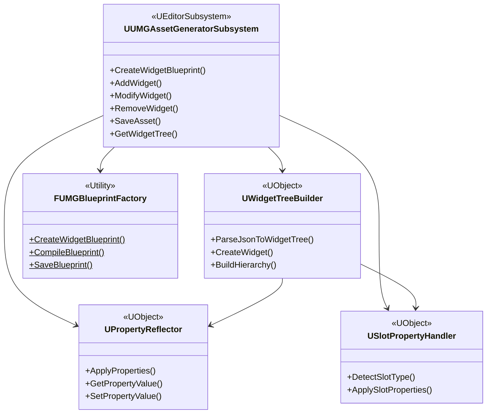
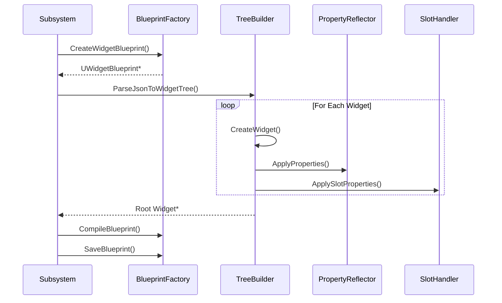

# 03. 클래스 설계
## UMG MCP Asset Generator System

---

## 1. 클래스 다이어그램

### 1.1 전체 클래스 구조



---

## 2. 핵심 클래스 상세

### 2.1 UUMGAssetGeneratorSubsystem

```cpp
// UMGAssetGeneratorSubsystem.h
#pragma once

#include "CoreMinimal.h"
#include "EditorSubsystem.h"
#include "UMGMCPTypes.h"
#include "UMGAssetGeneratorSubsystem.generated.h"

UCLASS()
class UMGMCPEDITOR_API UUMGAssetGeneratorSubsystem : public UEditorSubsystem
{
    GENERATED_BODY()

public:
    virtual void Initialize(FSubsystemCollectionBase& Collection) override;
    virtual void Deinitialize() override;

    UFUNCTION(BlueprintCallable, Category = "UMG MCP")
    static UUMGAssetGeneratorSubsystem* Get();

    UFUNCTION(BlueprintCallable, Category = "UMG MCP")
    FUMGOperationResult CreateWidgetBlueprint(
        const FString& AssetPath,
        const FString& ParentClass,
        const FString& RootWidgetJson,
        bool bOverwrite = false);

    UFUNCTION(BlueprintCallable, Category = "UMG MCP")
    FUMGOperationResult AddWidget(
        const FString& AssetPath,
        const FString& ParentWidgetName,
        const FString& WidgetSpecJson);

    UFUNCTION(BlueprintCallable, Category = "UMG MCP")
    FUMGOperationResult ModifyWidget(
        const FString& AssetPath,
        const FString& WidgetName,
        const FString& PropertiesJson,
        const FString& SlotPropertiesJson);

    UFUNCTION(BlueprintCallable, Category = "UMG MCP")
    FUMGOperationResult RemoveWidget(
        const FString& AssetPath,
        const FString& WidgetName);

    UFUNCTION(BlueprintCallable, Category = "UMG MCP")
    FUMGOperationResult SaveAsset(const FString& AssetPath, bool bCompile = true);

    UFUNCTION(BlueprintCallable, Category = "UMG MCP")
    FUMGWidgetTreeInfo GetWidgetTree(const FString& AssetPath);

private:
    UPROPERTY()
    TObjectPtr<UWidgetTreeBuilder> TreeBuilder;

    UPROPERTY()
    TObjectPtr<UPropertyReflector> PropertyReflector;

    UPROPERTY()
    TObjectPtr<USlotPropertyHandler> SlotHandler;
};
```

### 2.2 UWidgetTreeBuilder

```cpp
// WidgetTreeBuilder.h
#pragma once

#include "CoreMinimal.h"
#include "UObject/NoExportTypes.h"
#include "WidgetTreeBuilder.generated.h"

UCLASS()
class UMGMCPEDITOR_API UWidgetTreeBuilder : public UObject
{
    GENERATED_BODY()

public:
    void Initialize(UPropertyReflector* InReflector, USlotPropertyHandler* InSlotHandler);

    UWidget* ParseJsonToWidgetTree(
        const FString& JsonString,
        UWidgetTree* WidgetTree,
        FString& OutError);

    UWidget* CreateWidget(
        const FString& TypeName,
        const FString& WidgetName,
        UWidgetTree* WidgetTree,
        FString& OutError);

    bool AddChildToParent(UPanelWidget* Parent, UWidget* Child);

    void SetMaxRecursionDepth(int32 Depth) { MaxRecursionDepth = Depth; }
    const TArray<FString>& GetWarnings() const { return Warnings; }
    void ClearWarnings() { Warnings.Empty(); }

private:
    UWidget* ProcessWidgetNode(
        const TSharedPtr<FJsonObject>& JsonObject,
        UWidgetTree* WidgetTree,
        UPanelWidget* Parent,
        int32 CurrentDepth,
        FString& OutError);

    UClass* FindWidgetClass(const FString& TypeName);
    FString GenerateUniqueName(const FString& BaseName, UWidgetTree* WidgetTree);

    UPROPERTY()
    TObjectPtr<UPropertyReflector> PropertyReflector;

    UPROPERTY()
    TObjectPtr<USlotPropertyHandler> SlotHandler;

    TMap<FName, UClass*> WidgetClassCache;
    TSet<FString> UsedNames;
    int32 MaxRecursionDepth = 50;
    TArray<FString> Warnings;
};
```

### 2.3 UPropertyReflector

```cpp
// PropertyReflector.h
#pragma once

#include "CoreMinimal.h"
#include "UObject/NoExportTypes.h"
#include "PropertyReflector.generated.h"

UENUM()
enum class EUMGPropertyType : uint8
{
    Unknown, Bool, Int, Float, String, Name, Text, Enum, Struct, Object, Class, Array
};

UCLASS()
class UMGMCPEDITOR_API UPropertyReflector : public UObject
{
    GENERATED_BODY()

public:
    bool ApplyProperties(
        UObject* Target,
        const TSharedPtr<FJsonObject>& PropertiesJson,
        TArray<FString>& OutWarnings);

    bool SetPropertyValue(
        UObject* Target,
        const FString& PropertyName,
        const TSharedPtr<FJsonValue>& JsonValue,
        FString& OutError);

    FString GetPropertyValue(UObject* Target, const FString& PropertyName);
    EUMGPropertyType GetPropertyType(UClass* TargetClass, const FString& PropertyName);
    TArray<FName> GetEditableProperties(UClass* TargetClass);

private:
    FProperty* FindProperty(UClass* TargetClass, const FString& PropertyName);
    bool HandleStructProperty(void* StructData, FStructProperty* StructProp, 
        const TSharedPtr<FJsonObject>& JsonObject, FString& OutError);
    bool HandleAssetReference(UObject* Target, FObjectProperty* ObjectProp, 
        const FString& AssetPath, FString& OutError);
    bool HandleEnumProperty(void* ValuePtr, FEnumProperty* EnumProp, 
        const FString& EnumValueName, FString& OutError);
};
```

### 2.4 USlotPropertyHandler

```cpp
// SlotPropertyHandler.h
#pragma once

#include "CoreMinimal.h"
#include "UObject/NoExportTypes.h"
#include "SlotPropertyHandler.generated.h"

UENUM()
enum class EUMGSlotType : uint8
{
    Unknown, CanvasPanelSlot, HorizontalBoxSlot, VerticalBoxSlot, 
    GridSlot, OverlaySlot, UniformGridSlot, SizeBoxSlot
};

UENUM()
enum class EUMGAnchorPreset : uint8
{
    TopLeft, TopCenter, TopRight, CenterLeft, Center, CenterRight,
    BottomLeft, BottomCenter, BottomRight, StretchAll, Custom
};

UCLASS()
class UMGMCPEDITOR_API USlotPropertyHandler : public UObject
{
    GENERATED_BODY()

public:
    EUMGSlotType DetectSlotType(UPanelWidget* ParentWidget);
    
    bool ApplySlotProperties(
        UWidget* ChildWidget,
        const TSharedPtr<FJsonObject>& SlotPropertiesJson,
        TArray<FString>& OutWarnings);

    TArray<FName> GetSlotPropertyNames(EUMGSlotType SlotType);
    bool ApplyAnchorPreset(UWidget* ChildWidget, EUMGAnchorPreset Preset);

private:
    bool ApplyCanvasSlotProperties(class UCanvasPanelSlot* Slot, 
        const TSharedPtr<FJsonObject>& JsonObject, TArray<FString>& OutWarnings);
    bool ApplyBoxSlotProperties(class UPanelSlot* Slot, 
        const TSharedPtr<FJsonObject>& JsonObject, TArray<FString>& OutWarnings);
    bool ParseAnchors(const TSharedPtr<FJsonObject>& JsonObject, FAnchors& OutAnchors);
    FAnchors GetAnchorsForPreset(EUMGAnchorPreset Preset);
};
```

---

## 3. 데이터 구조체

```cpp
// UMGMCPTypes.h
#pragma once

#include "CoreMinimal.h"
#include "UMGMCPTypes.generated.h"

USTRUCT(BlueprintType)
struct UMGMCPRUNTIME_API FUMGOperationResult
{
    GENERATED_BODY()

    UPROPERTY(BlueprintReadOnly) bool bSuccess = false;
    UPROPERTY(BlueprintReadOnly) int32 ErrorCode = 0;
    UPROPERTY(BlueprintReadOnly) FString ErrorMessage;
    UPROPERTY(BlueprintReadOnly) FString AssetPath;
    UPROPERTY(BlueprintReadOnly) int32 WidgetCount = 0;
    UPROPERTY(BlueprintReadOnly) TArray<FString> Warnings;
    UPROPERTY(BlueprintReadOnly) FString CompileStatus;

    static FUMGOperationResult Success(const FString& Path, int32 Count);
    static FUMGOperationResult Failure(int32 Code, const FString& Message);
};

USTRUCT(BlueprintType)
struct UMGMCPRUNTIME_API FUMGWidgetInfo
{
    GENERATED_BODY()

    UPROPERTY(BlueprintReadOnly) FString Name;
    UPROPERTY(BlueprintReadOnly) FString Type;
    UPROPERTY(BlueprintReadOnly) FString ParentName;
    UPROPERTY(BlueprintReadOnly) TArray<FString> ChildrenNames;
    UPROPERTY(BlueprintReadOnly) FString SlotType;
};

USTRUCT(BlueprintType)
struct UMGMCPRUNTIME_API FUMGWidgetTreeInfo
{
    GENERATED_BODY()

    UPROPERTY(BlueprintReadOnly) FString AssetPath;
    UPROPERTY(BlueprintReadOnly) FString RootWidgetName;
    UPROPERTY(BlueprintReadOnly) TArray<FUMGWidgetInfo> Widgets;
    UPROPERTY(BlueprintReadOnly) int32 TotalWidgetCount = 0;
};
```

---

## 4. 에러 코드 정의

```cpp
// UMGMCPErrorCodes.h
namespace UMGMCPError
{
    // 입력 검증 (1000-1099)
    constexpr int32 InvalidJson = 1001;
    constexpr int32 MissingRequiredField = 1002;

    // 위젯 생성 (2000-2099)
    constexpr int32 UnknownWidgetType = 2001;
    constexpr int32 WidgetCreationFailed = 2002;
    constexpr int32 MaxDepthExceeded = 2004;

    // 속성 적용 (3000-3099)
    constexpr int32 PropertyNotFound = 3001;
    constexpr int32 PropertyTypeMismatch = 3002;

    // 슬롯 처리 (4000-4099)
    constexpr int32 InvalidSlotType = 4001;

    // 에셋 관리 (5000-5099)
    constexpr int32 InvalidAssetPath = 5001;
    constexpr int32 CompileFailed = 5004;
    constexpr int32 SaveFailed = 5005;
}
```

---

## 5. 객체 생명주기


