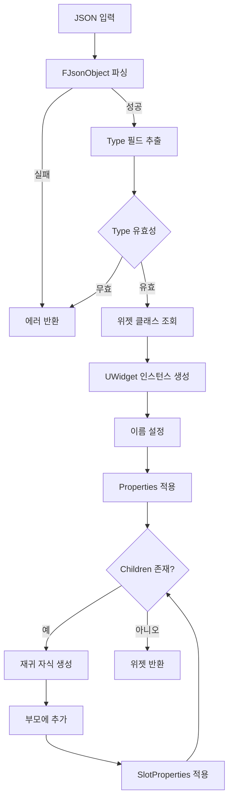

# 05. 위젯 트리 빌더 상세 설계
## UMG MCP Asset Generator System

---

## 1. 개요

`UWidgetTreeBuilder`는 JSON 명세를 파싱하여 UMG 위젯 트리를 재귀적으로 생성하는 핵심 클래스입니다.

### 1.1 주요 책임

| 책임 | 설명 |
|------|------|
| JSON 파싱 | JSON 문자열을 FJsonObject로 변환 |
| 위젯 생성 | 타입명으로 적절한 UWidget 인스턴스 생성 |
| 계층 구조 구성 | 부모-자식 관계 설정 |
| 이름 관리 | 고유 위젯 이름 생성 및 충돌 방지 |
| 깊이 제한 | 무한 재귀 방지 |

---

## 2. 위젯 생성 흐름



---

## 3. 핵심 알고리즘

### 3.1 재귀 위젯 생성

```cpp
UWidget* UWidgetTreeBuilder::ProcessWidgetNode(
    const TSharedPtr<FJsonObject>& JsonObject,
    UWidgetTree* WidgetTree,
    UPanelWidget* Parent,
    int32 CurrentDepth,
    FString& OutError)
{
    // 1. 깊이 제한 검사
    if (CurrentDepth > MaxRecursionDepth)
    {
        OutError = FString::Printf(TEXT("Maximum recursion depth (%d) exceeded"), MaxRecursionDepth);
        return nullptr;
    }

    // 2. Type 필드 추출
    FString WidgetType;
    if (!JsonObject->TryGetStringField(TEXT("Type"), WidgetType))
    {
        OutError = TEXT("Missing required field: Type");
        return nullptr;
    }

    // 3. Name 필드 추출 또는 생성
    FString WidgetName;
    if (!JsonObject->TryGetStringField(TEXT("Name"), WidgetName))
    {
        WidgetName = GenerateUniqueName(WidgetType, WidgetTree);
    }
    else
    {
        WidgetName = GenerateUniqueName(WidgetName, WidgetTree);
    }

    // 4. 위젯 생성
    UWidget* NewWidget = CreateWidget(WidgetType, WidgetName, WidgetTree, OutError);
    if (!NewWidget)
    {
        return nullptr;
    }

    // 5. Properties 적용
    const TSharedPtr<FJsonObject>* PropertiesObj;
    if (JsonObject->TryGetObjectField(TEXT("Properties"), PropertiesObj))
    {
        TArray<FString> PropWarnings;
        PropertyReflector->ApplyProperties(NewWidget, *PropertiesObj, PropWarnings);
        Warnings.Append(PropWarnings);
    }

    // 6. 부모에 추가 (있는 경우)
    if (Parent)
    {
        if (!AddChildToParent(Parent, NewWidget))
        {
            OutError = FString::Printf(TEXT("Failed to add %s to parent"), *WidgetName);
            return nullptr;
        }

        // 7. SlotProperties 적용
        const TSharedPtr<FJsonObject>* SlotPropsObj;
        if (JsonObject->TryGetObjectField(TEXT("SlotProperties"), SlotPropsObj))
        {
            TArray<FString> SlotWarnings;
            SlotHandler->ApplySlotProperties(NewWidget, *SlotPropsObj, SlotWarnings);
            Warnings.Append(SlotWarnings);
        }
    }

    // 8. Children 재귀 처리
    const TArray<TSharedPtr<FJsonValue>>* ChildrenArray;
    if (JsonObject->TryGetArrayField(TEXT("Children"), ChildrenArray))
    {
        UPanelWidget* PanelWidget = Cast<UPanelWidget>(NewWidget);
        if (!PanelWidget)
        {
            Warnings.Add(FString::Printf(TEXT("%s: Cannot have children (not a panel widget)"), *WidgetName));
        }
        else
        {
            for (const TSharedPtr<FJsonValue>& ChildValue : *ChildrenArray)
            {
                const TSharedPtr<FJsonObject>* ChildObject;
                if (ChildValue->TryGetObject(ChildObject))
                {
                    ProcessWidgetNode(*ChildObject, WidgetTree, PanelWidget, CurrentDepth + 1, OutError);
                }
            }
        }
    }

    return NewWidget;
}
```

### 3.2 위젯 클래스 조회

```cpp
UClass* UWidgetTreeBuilder::FindWidgetClass(const FString& TypeName)
{
    // 캐시 확인
    FName TypeFName(*TypeName);
    if (UClass** CachedClass = WidgetClassCache.Find(TypeFName))
    {
        return *CachedClass;
    }

    // 표준 위젯 타입 매핑
    static TMap<FName, FName> TypeToClassName = {
        {TEXT("CanvasPanel"), TEXT("CanvasPanel")},
        {TEXT("VerticalBox"), TEXT("VerticalBox")},
        {TEXT("HorizontalBox"), TEXT("HorizontalBox")},
        {TEXT("GridPanel"), TEXT("GridPanel")},
        {TEXT("Overlay"), TEXT("Overlay")},
        {TEXT("SizeBox"), TEXT("SizeBox")},
        {TEXT("ScaleBox"), TEXT("ScaleBox")},
        {TEXT("ScrollBox"), TEXT("ScrollBox")},
        {TEXT("TextBlock"), TEXT("TextBlock")},
        {TEXT("Image"), TEXT("Image")},
        {TEXT("Button"), TEXT("Button")},
        {TEXT("Border"), TEXT("Border")},
        {TEXT("ProgressBar"), TEXT("ProgressBar")},
        {TEXT("Slider"), TEXT("Slider")},
        {TEXT("CheckBox"), TEXT("CheckBox")},
        {TEXT("EditableText"), TEXT("EditableText")},
        {TEXT("Spacer"), TEXT("Spacer")},
        {TEXT("Throbber"), TEXT("Throbber")}
    };

    FName* ClassName = TypeToClassName.Find(TypeFName);
    if (!ClassName)
    {
        return nullptr;
    }

    // 클래스 검색
    FString FullClassName = FString::Printf(TEXT("/Script/UMG.%s"), **ClassName);
    UClass* WidgetClass = LoadClass<UWidget>(nullptr, *FullClassName);

    if (WidgetClass)
    {
        WidgetClassCache.Add(TypeFName, WidgetClass);
    }

    return WidgetClass;
}
```

### 3.3 고유 이름 생성

```cpp
FString UWidgetTreeBuilder::GenerateUniqueName(const FString& BaseName, UWidgetTree* WidgetTree)
{
    FString CandidateName = BaseName;
    int32 Counter = 1;

    while (UsedNames.Contains(CandidateName) || WidgetTree->FindWidget(FName(*CandidateName)))
    {
        CandidateName = FString::Printf(TEXT("%s_%d"), *BaseName, Counter++);
    }

    UsedNames.Add(CandidateName);
    return CandidateName;
}
```

---

## 4. 부모-자식 관계 처리

### 4.1 자식 추가 로직

```cpp
bool UWidgetTreeBuilder::AddChildToParent(UPanelWidget* Parent, UWidget* Child)
{
    if (!Parent || !Child)
    {
        return false;
    }

    // 단일 자식만 허용하는 위젯 타입 확인
    if (USizeBox* SizeBox = Cast<USizeBox>(Parent))
    {
        if (SizeBox->GetChildrenCount() > 0)
        {
            Warnings.Add(FString::Printf(TEXT("SizeBox already has a child. Replacing.")));
            SizeBox->ClearChildren();
        }
    }
    else if (UBorder* Border = Cast<UBorder>(Parent))
    {
        if (Border->GetChildrenCount() > 0)
        {
            Warnings.Add(FString::Printf(TEXT("Border already has a child. Replacing.")));
            Border->ClearChildren();
        }
    }
    else if (UButton* Button = Cast<UButton>(Parent))
    {
        if (Button->GetChildrenCount() > 0)
        {
            Warnings.Add(FString::Printf(TEXT("Button already has a child. Replacing.")));
            Button->ClearChildren();
        }
    }

    // 자식 추가
    UPanelSlot* Slot = Parent->AddChild(Child);
    return Slot != nullptr;
}
```

---

## 5. 에러 처리

### 5.1 에러 코드 및 메시지

| 상황 | 에러 코드 | 메시지 |
|------|----------|--------|
| 깊이 초과 | 2004 | Maximum recursion depth exceeded |
| Type 누락 | 1002 | Missing required field: Type |
| 미지원 타입 | 2001 | Unknown widget type: {type} |
| 생성 실패 | 2002 | Failed to create widget: {name} |
| 부모 추가 실패 | 2005 | Failed to add {name} to parent |

### 5.2 경고 처리

- 비패널 위젯에 Children 지정 → 무시 + 경고
- 단일 자식 위젯에 중복 자식 → 교체 + 경고
- 잘못된 속성명 → 무시 + 경고

---

## 6. 성능 최적화

### 6.1 클래스 캐싱

```cpp
// 매번 LoadClass 호출 대신 캐시 사용
TMap<FName, UClass*> WidgetClassCache;
```

### 6.2 이름 추적

```cpp
// FindWidget 호출 최소화를 위한 사용 이름 추적
TSet<FString> UsedNames;
```

---

## 7. 사용 예시

```cpp
// 서브시스템에서 호출
UWidgetBlueprint* Blueprint = LoadBlueprint(AssetPath);
UWidgetTree* WidgetTree = Blueprint->WidgetTree;

FString Error;
TreeBuilder->ClearWarnings();

UWidget* RootWidget = TreeBuilder->ParseJsonToWidgetTree(JsonString, WidgetTree, Error);

if (RootWidget)
{
    WidgetTree->RootWidget = RootWidget;
    
    const TArray<FString>& Warnings = TreeBuilder->GetWarnings();
    for (const FString& Warning : Warnings)
    {
        UE_LOG(LogUMGMCP, Warning, TEXT("%s"), *Warning);
    }
}
else
{
    UE_LOG(LogUMGMCP, Error, TEXT("Failed: %s"), *Error);
}
```
