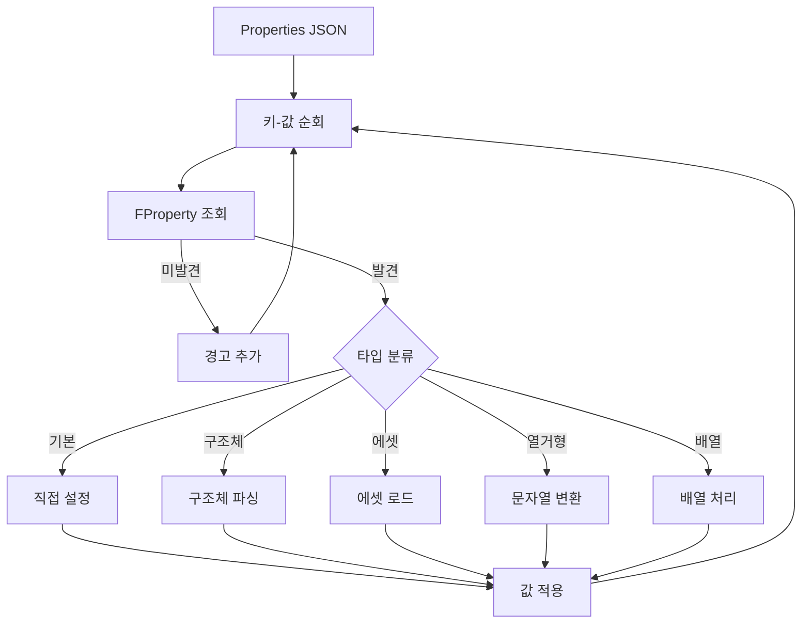

# 06. 속성 리플렉션 시스템
## UMG MCP Asset Generator System

---

## 1. 개요

`UPropertyReflector`는 언리얼 엔진의 리플렉션 시스템을 활용하여 JSON 값을 UWidget 속성에 동적으로 적용합니다.

### 1.1 지원 속성 타입

| 타입 | C++ 타입 | JSON 형식 | 예시 |
|------|----------|----------|------|
| Bool | bool | boolean | `true` |
| Int | int32 | number | `42` |
| Float | float | number | `3.14` |
| String | FString | string | `"Hello"` |
| Name | FName | string | `"MyName"` |
| Text | FText | string | `"표시 텍스트"` |
| Enum | UEnum | string | `"Visible"` |
| Struct | UScriptStruct | object | `{"X": 1, "Y": 2}` |
| Object | UObject* | string (경로) | `"/Game/Texture"` |
| Array | TArray | array | `[1, 2, 3]` |

---

## 2. 속성 적용 흐름



---

## 3. 핵심 구현

### 3.1 속성 적용 메인 함수

```cpp
bool UPropertyReflector::ApplyProperties(
    UObject* Target,
    const TSharedPtr<FJsonObject>& PropertiesJson,
    TArray<FString>& OutWarnings)
{
    if (!Target || !PropertiesJson.IsValid())
    {
        return false;
    }

    bool bAllSuccess = true;
    UClass* TargetClass = Target->GetClass();

    for (const auto& Pair : PropertiesJson->Values)
    {
        const FString& PropertyName = Pair.Key;
        const TSharedPtr<FJsonValue>& JsonValue = Pair.Value;

        FString Error;
        if (!SetPropertyValue(Target, PropertyName, JsonValue, Error))
        {
            OutWarnings.Add(FString::Printf(TEXT("%s: %s"), *PropertyName, *Error));
            bAllSuccess = false;
        }
    }

    return bAllSuccess;
}
```

### 3.2 단일 속성 설정

```cpp
bool UPropertyReflector::SetPropertyValue(
    UObject* Target,
    const FString& PropertyName,
    const TSharedPtr<FJsonValue>& JsonValue,
    FString& OutError)
{
    UClass* TargetClass = Target->GetClass();
    FProperty* Property = FindProperty(TargetClass, PropertyName);

    if (!Property)
    {
        OutError = TEXT("Property not found");
        return false;
    }

    void* ValuePtr = Property->ContainerPtrToValuePtr<void>(Target);

    // Bool
    if (FBoolProperty* BoolProp = CastField<FBoolProperty>(Property))
    {
        bool Value;
        if (JsonValue->TryGetBool(Value))
        {
            BoolProp->SetPropertyValue(ValuePtr, Value);
            return true;
        }
    }
    // Int
    else if (FIntProperty* IntProp = CastField<FIntProperty>(Property))
    {
        int32 Value;
        if (JsonValue->TryGetNumber(Value))
        {
            IntProp->SetPropertyValue(ValuePtr, Value);
            return true;
        }
    }
    // Float
    else if (FFloatProperty* FloatProp = CastField<FFloatProperty>(Property))
    {
        double Value;
        if (JsonValue->TryGetNumber(Value))
        {
            FloatProp->SetPropertyValue(ValuePtr, static_cast<float>(Value));
            return true;
        }
    }
    // String
    else if (FStrProperty* StrProp = CastField<FStrProperty>(Property))
    {
        FString Value;
        if (JsonValue->TryGetString(Value))
        {
            StrProp->SetPropertyValue(ValuePtr, Value);
            return true;
        }
    }
    // Text
    else if (FTextProperty* TextProp = CastField<FTextProperty>(Property))
    {
        FString Value;
        if (JsonValue->TryGetString(Value))
        {
            TextProp->SetPropertyValue(ValuePtr, FText::FromString(Value));
            return true;
        }
    }
    // Enum
    else if (FEnumProperty* EnumProp = CastField<FEnumProperty>(Property))
    {
        FString Value;
        if (JsonValue->TryGetString(Value))
        {
            return HandleEnumProperty(ValuePtr, EnumProp, Value, OutError);
        }
    }
    // Struct
    else if (FStructProperty* StructProp = CastField<FStructProperty>(Property))
    {
        const TSharedPtr<FJsonObject>* ObjValue;
        if (JsonValue->TryGetObject(ObjValue))
        {
            return HandleStructProperty(ValuePtr, StructProp, *ObjValue, OutError);
        }
    }
    // Object (에셋 참조)
    else if (FObjectProperty* ObjectProp = CastField<FObjectProperty>(Property))
    {
        FString AssetPath;
        if (JsonValue->TryGetString(AssetPath))
        {
            return HandleAssetReference(Target, ObjectProp, AssetPath, OutError);
        }
    }

    OutError = TEXT("Unsupported property type or value mismatch");
    return false;
}
```

---

## 4. 구조체 처리

### 4.1 지원 구조체

| 구조체 | 필드 | 용도 |
|--------|------|------|
| FLinearColor | R, G, B, A | 색상 |
| FSlateColor | SpecifiedColor | 슬레이트 색상 |
| FVector2D | X, Y | 2D 벡터 |
| FMargin | Left, Top, Right, Bottom | 여백 |
| FAnchors | Minimum, Maximum | 앵커 |
| FSlateFontInfo | FontObject, Size | 폰트 정보 |
| FSlateBrush | ResourceObject, ImageSize | 브러시 |

### 4.2 구조체 파싱 구현

```cpp
bool UPropertyReflector::HandleStructProperty(
    void* StructData,
    FStructProperty* StructProp,
    const TSharedPtr<FJsonObject>& JsonObject,
    FString& OutError)
{
    UScriptStruct* Struct = StructProp->Struct;
    FName StructName = Struct->GetFName();

    // FLinearColor
    if (StructName == NAME_LinearColor)
    {
        FLinearColor& Color = *static_cast<FLinearColor*>(StructData);
        return ParseLinearColor(JsonObject, Color);
    }
    // FVector2D
    else if (StructName == NAME_Vector2D)
    {
        FVector2D& Vec = *static_cast<FVector2D*>(StructData);
        return ParseVector2D(JsonObject, Vec);
    }
    // FMargin
    else if (StructName == TEXT("Margin"))
    {
        FMargin& Margin = *static_cast<FMargin*>(StructData);
        return ParseMargin(JsonObject, Margin);
    }
    // 일반 구조체 - 재귀적 필드 적용
    else
    {
        for (TFieldIterator<FProperty> It(Struct); It; ++It)
        {
            FProperty* FieldProp = *It;
            FString FieldName = FieldProp->GetName();

            if (JsonObject->HasField(FieldName))
            {
                void* FieldPtr = FieldProp->ContainerPtrToValuePtr<void>(StructData);
                // 재귀적 처리
            }
        }
        return true;
    }

    OutError = FString::Printf(TEXT("Unsupported struct type: %s"), *StructName.ToString());
    return false;
}
```

### 4.3 헬퍼 함수

```cpp
bool UPropertyReflector::ParseLinearColor(const TSharedPtr<FJsonObject>& JsonObject, FLinearColor& OutColor)
{
    OutColor.R = JsonObject->GetNumberField(TEXT("R"));
    OutColor.G = JsonObject->GetNumberField(TEXT("G"));
    OutColor.B = JsonObject->GetNumberField(TEXT("B"));
    OutColor.A = JsonObject->HasField(TEXT("A")) ? JsonObject->GetNumberField(TEXT("A")) : 1.0f;
    return true;
}

bool UPropertyReflector::ParseMargin(const TSharedPtr<FJsonObject>& JsonObject, FMargin& OutMargin)
{
    OutMargin.Left = JsonObject->GetNumberField(TEXT("Left"));
    OutMargin.Top = JsonObject->GetNumberField(TEXT("Top"));
    OutMargin.Right = JsonObject->GetNumberField(TEXT("Right"));
    OutMargin.Bottom = JsonObject->GetNumberField(TEXT("Bottom"));
    return true;
}

bool UPropertyReflector::ParseVector2D(const TSharedPtr<FJsonObject>& JsonObject, FVector2D& OutVector)
{
    OutVector.X = JsonObject->GetNumberField(TEXT("X"));
    OutVector.Y = JsonObject->GetNumberField(TEXT("Y"));
    return true;
}
```

---

## 5. 열거형 처리

```cpp
bool UPropertyReflector::HandleEnumProperty(
    void* ValuePtr,
    FEnumProperty* EnumProp,
    const FString& EnumValueName,
    FString& OutError)
{
    UEnum* Enum = EnumProp->GetEnum();
    
    // 이름으로 값 찾기
    int64 EnumValue = Enum->GetValueByNameString(EnumValueName);
    
    if (EnumValue == INDEX_NONE)
    {
        // 축약형 시도 (예: "Visible" -> "ESlateVisibility::Visible")
        for (int32 i = 0; i < Enum->NumEnums(); i++)
        {
            FString FullName = Enum->GetNameStringByIndex(i);
            if (FullName.EndsWith(EnumValueName))
            {
                EnumValue = Enum->GetValueByIndex(i);
                break;
            }
        }
    }

    if (EnumValue == INDEX_NONE)
    {
        OutError = FString::Printf(TEXT("Invalid enum value: %s"), *EnumValueName);
        return false;
    }

    EnumProp->GetUnderlyingProperty()->SetIntPropertyValue(ValuePtr, EnumValue);
    return true;
}
```

---

## 6. 에셋 참조 처리

```cpp
bool UPropertyReflector::HandleAssetReference(
    UObject* Target,
    FObjectProperty* ObjectProp,
    const FString& AssetPath,
    FString& OutError)
{
    // 에셋 로드
    UObject* Asset = LoadObject<UObject>(nullptr, *AssetPath);

    if (!Asset)
    {
        // FSoftObjectPath 시도
        FSoftObjectPath SoftPath(AssetPath);
        Asset = SoftPath.TryLoad();
    }

    if (!Asset)
    {
        OutError = FString::Printf(TEXT("Failed to load asset: %s"), *AssetPath);
        return false;
    }

    // 타입 검사
    if (!Asset->IsA(ObjectProp->PropertyClass))
    {
        OutError = FString::Printf(TEXT("Asset type mismatch. Expected: %s"), 
            *ObjectProp->PropertyClass->GetName());
        return false;
    }

    ObjectProp->SetObjectPropertyValue(
        ObjectProp->ContainerPtrToValuePtr<void>(Target), 
        Asset);
    return true;
}
```

---

## 7. 속성 조회

### 7.1 편집 가능 속성 목록

```cpp
TArray<FName> UPropertyReflector::GetEditableProperties(UClass* TargetClass)
{
    TArray<FName> Result;

    for (TFieldIterator<FProperty> It(TargetClass); It; ++It)
    {
        FProperty* Property = *It;

        // EditAnywhere 또는 BlueprintReadWrite 플래그 확인
        if (Property->HasAnyPropertyFlags(CPF_Edit | CPF_BlueprintVisible))
        {
            Result.Add(Property->GetFName());
        }
    }

    return Result;
}
```

### 7.2 속성 타입 조회

```cpp
EUMGPropertyType UPropertyReflector::GetPropertyType(UClass* TargetClass, const FString& PropertyName)
{
    FProperty* Property = FindProperty(TargetClass, PropertyName);
    
    if (!Property)
        return EUMGPropertyType::Unknown;

    if (CastField<FBoolProperty>(Property)) return EUMGPropertyType::Bool;
    if (CastField<FIntProperty>(Property)) return EUMGPropertyType::Int;
    if (CastField<FFloatProperty>(Property)) return EUMGPropertyType::Float;
    if (CastField<FStrProperty>(Property)) return EUMGPropertyType::String;
    if (CastField<FNameProperty>(Property)) return EUMGPropertyType::Name;
    if (CastField<FTextProperty>(Property)) return EUMGPropertyType::Text;
    if (CastField<FEnumProperty>(Property)) return EUMGPropertyType::Enum;
    if (CastField<FStructProperty>(Property)) return EUMGPropertyType::Struct;
    if (CastField<FObjectProperty>(Property)) return EUMGPropertyType::Object;
    if (CastField<FArrayProperty>(Property)) return EUMGPropertyType::Array;

    return EUMGPropertyType::Unknown;
}
```
