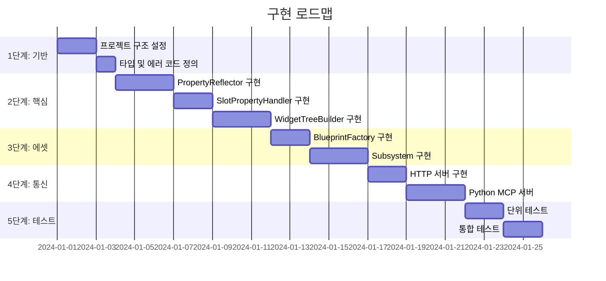

# 10. 구현 가이드 및 예제 코드
## UMG MCP Asset Generator System

---

## 1. 구현 순서

### 1.1 권장 구현 단계



---

## 2. 플러그인 설정

### 2.1 UMGMCP.uplugin

```json
{
    "FileVersion": 3,
    "Version": 1,
    "VersionName": "1.0",
    "FriendlyName": "UMG MCP Asset Generator",
    "Description": "AI-driven UMG widget blueprint generation via MCP",
    "Category": "Editor",
    "CreatedBy": "Your Name",
    "CreatedByURL": "",
    "DocsURL": "",
    "MarketplaceURL": "",
    "CanContainContent": true,
    "IsBetaVersion": true,
    "IsExperimentalVersion": false,
    "Installed": false,
    "Modules": [
        {
            "Name": "UMGMCPRuntime",
            "Type": "Runtime",
            "LoadingPhase": "Default"
        },
        {
            "Name": "UMGMCPEditor",
            "Type": "Editor",
            "LoadingPhase": "Default"
        }
    ]
}
```

### 2.2 UMGMCPRuntime.Build.cs

```csharp
using UnrealBuildTool;

public class UMGMCPRuntime : ModuleRules
{
    public UMGMCPRuntime(ReadOnlyTargetRules Target) : base(Target)
    {
        PCHUsage = PCHUsageMode.UseExplicitOrSharedPCHs;

        PublicDependencyModuleNames.AddRange(new string[]
        {
            "Core",
            "CoreUObject",
            "Engine",
            "UMG",
            "Json",
            "JsonUtilities"
        });
    }
}
```

### 2.3 UMGMCPEditor.Build.cs

```csharp
using UnrealBuildTool;

public class UMGMCPEditor : ModuleRules
{
    public UMGMCPEditor(ReadOnlyTargetRules Target) : base(Target)
    {
        PCHUsage = PCHUsageMode.UseExplicitOrSharedPCHs;

        PublicDependencyModuleNames.AddRange(new string[]
        {
            "Core",
            "CoreUObject",
            "Engine",
            "UMG",
            "Slate",
            "SlateCore",
            "UMGMCPRuntime"
        });

        PrivateDependencyModuleNames.AddRange(new string[]
        {
            "UnrealEd",
            "UMGEditor",
            "Kismet",
            "BlueprintGraph",
            "HTTP",
            "Json",
            "JsonUtilities",
            "AssetTools",
            "ContentBrowser",
            "EditorSubsystem"
        });
    }
}
```

---

## 3. 모듈 초기화

### 3.1 UMGMCPRuntimeModule.cpp

```cpp
#include "UMGMCPRuntimeModule.h"
#include "Modules/ModuleManager.h"

DEFINE_LOG_CATEGORY(LogUMGMCP);

void FUMGMCPRuntimeModule::StartupModule()
{
    UE_LOG(LogUMGMCP, Log, TEXT("UMG MCP Runtime Module Started"));
}

void FUMGMCPRuntimeModule::ShutdownModule()
{
    UE_LOG(LogUMGMCP, Log, TEXT("UMG MCP Runtime Module Shutdown"));
}

IMPLEMENT_MODULE(FUMGMCPRuntimeModule, UMGMCPRuntime)
```

### 3.2 UMGMCPEditorModule.cpp

```cpp
#include "UMGMCPEditorModule.h"
#include "UMGMCPHttpServer.h"
#include "Modules/ModuleManager.h"

void FUMGMCPEditorModule::StartupModule()
{
    UE_LOG(LogUMGMCP, Log, TEXT("UMG MCP Editor Module Started"));

    // HTTP 서버 자동 시작
    FUMGMCPHttpServer::Get().Start(8080);
}

void FUMGMCPEditorModule::ShutdownModule()
{
    // HTTP 서버 정지
    FUMGMCPHttpServer::Get().Stop();

    UE_LOG(LogUMGMCP, Log, TEXT("UMG MCP Editor Module Shutdown"));
}

IMPLEMENT_MODULE(FUMGMCPEditorModule, UMGMCPEditor)
```

---

## 4. 전체 사용 예제

### 4.1 AI 에이전트에서의 사용

```python
# Claude가 MCP 도구를 사용하여 UI 생성
await umg_create_asset(
    asset_path="/Game/UI/MainMenu",
    root_widget={
        "Type": "CanvasPanel",
        "Name": "RootCanvas",
        "Children": [
            {
                "Type": "Image",
                "Name": "Background",
                "Properties": {
                    "Brush": {
                        "ResourceObject": "/Game/Textures/MenuBG"
                    }
                },
                "SlotProperties": {
                    "AnchorPreset": "StretchAll"
                }
            },
            {
                "Type": "VerticalBox",
                "Name": "ButtonContainer",
                "SlotProperties": {
                    "AnchorPreset": "Center",
                    "Alignment": {"X": 0.5, "Y": 0.5}
                },
                "Children": [
                    {
                        "Type": "Button",
                        "Name": "PlayButton",
                        "SlotProperties": {
                            "Padding": {"Bottom": 10}
                        },
                        "Children": [
                            {
                                "Type": "TextBlock",
                                "Name": "PlayText",
                                "Properties": {
                                    "Text": "Play Game",
                                    "Font": {"Size": 24}
                                }
                            }
                        ]
                    },
                    {
                        "Type": "Button",
                        "Name": "OptionsButton",
                        "SlotProperties": {
                            "Padding": {"Bottom": 10}
                        },
                        "Children": [
                            {
                                "Type": "TextBlock",
                                "Name": "OptionsText",
                                "Properties": {
                                    "Text": "Options"
                                }
                            }
                        ]
                    }
                ]
            }
        ]
    },
    overwrite=True
)
```

### 4.2 위젯 수정 예제

```python
# 기존 위젯 속성 변경
await umg_modify_widget(
    asset_path="/Game/UI/MainMenu",
    widget_name="PlayText",
    properties={
        "Text": "Start Adventure",
        "ColorAndOpacity": {"R": 1, "G": 0.8, "B": 0, "A": 1}
    }
)

# 슬롯 속성 변경
await umg_modify_widget(
    asset_path="/Game/UI/MainMenu",
    widget_name="ButtonContainer",
    slot_properties={
        "Offsets": {"Left": -100, "Top": 50, "Right": 100, "Bottom": -50}
    }
)
```

### 4.3 위젯 추가 예제

```python
# 새 버튼 추가
await umg_add_widget(
    asset_path="/Game/UI/MainMenu",
    parent_widget_name="ButtonContainer",
    widget_spec={
        "Type": "Button",
        "Name": "QuitButton",
        "SlotProperties": {
            "Padding": {"Top": 20}
        },
        "Children": [
            {
                "Type": "TextBlock",
                "Name": "QuitText",
                "Properties": {"Text": "Quit"}
            }
        ]
    }
)

# 저장
await umg_save_asset(asset_path="/Game/UI/MainMenu")
```

---

## 5. C++ 직접 호출

### 5.1 에디터 유틸리티 블루프린트에서

```cpp
// 블루프린트에서 호출 가능
void UMyEditorUtility::CreateUIFromJson()
{
    UUMGAssetGeneratorSubsystem* Subsystem = UUMGAssetGeneratorSubsystem::Get();
    if (!Subsystem)
    {
        UE_LOG(LogTemp, Error, TEXT("Subsystem not available"));
        return;
    }

    FString Json = R"({
        "Type": "CanvasPanel",
        "Name": "Root",
        "Children": [
            {
                "Type": "TextBlock",
                "Name": "Title",
                "Properties": {
                    "Text": "Hello from Code!"
                }
            }
        ]
    })";

    FUMGOperationResult Result = Subsystem->CreateWidgetBlueprint(
        TEXT("/Game/UI/CodeGenerated"),
        TEXT(""),  // 기본 UUserWidget
        Json,
        true  // 덮어쓰기
    );

    if (Result.bSuccess)
    {
        UE_LOG(LogTemp, Log, TEXT("Created: %s with %d widgets"), 
            *Result.AssetPath, Result.WidgetCount);
    }
    else
    {
        UE_LOG(LogTemp, Error, TEXT("Failed: %s"), *Result.ErrorMessage);
    }
}
```

---

## 6. 테스트 케이스

### 6.1 단위 테스트 예제

```cpp
// UMGMCPTests.cpp
#include "Misc/AutomationTest.h"
#include "WidgetTreeBuilder.h"
#include "PropertyReflector.h"

IMPLEMENT_SIMPLE_AUTOMATION_TEST(
    FWidgetTreeBuilderTest,
    "UMGMCP.WidgetTreeBuilder.BasicCreation",
    EAutomationTestFlags::EditorContext | EAutomationTestFlags::ProductFilter
)

bool FWidgetTreeBuilderTest::RunTest(const FString& Parameters)
{
    // 테스트용 위젯 트리 생성
    UWidgetBlueprint* TestBP = NewObject<UWidgetBlueprint>();
    TestBP->WidgetTree = NewObject<UWidgetTree>(TestBP);

    UWidgetTreeBuilder* Builder = NewObject<UWidgetTreeBuilder>();
    UPropertyReflector* Reflector = NewObject<UPropertyReflector>();
    USlotPropertyHandler* SlotHandler = NewObject<USlotPropertyHandler>();
    
    Builder->Initialize(Reflector, SlotHandler);

    FString TestJson = R"({
        "Type": "CanvasPanel",
        "Name": "TestRoot",
        "Children": [
            {
                "Type": "TextBlock",
                "Name": "TestText",
                "Properties": {
                    "Text": "Test"
                }
            }
        ]
    })";

    FString Error;
    UWidget* RootWidget = Builder->ParseJsonToWidgetTree(
        TestJson, TestBP->WidgetTree, Error);

    // 검증
    TestNotNull(TEXT("Root widget created"), RootWidget);
    TestEqual(TEXT("Root widget name"), RootWidget->GetName(), TEXT("TestRoot"));
    
    UPanelWidget* Panel = Cast<UPanelWidget>(RootWidget);
    TestNotNull(TEXT("Root is panel"), Panel);
    TestEqual(TEXT("Child count"), Panel->GetChildrenCount(), 1);

    return true;
}
```

---

## 7. 디버깅 팁

### 7.1 로그 카테고리

```cpp
// UMGMCPTypes.h
DECLARE_LOG_CATEGORY_EXTERN(LogUMGMCP, Log, All);

// 사용
UE_LOG(LogUMGMCP, Log, TEXT("Creating widget: %s"), *WidgetName);
UE_LOG(LogUMGMCP, Warning, TEXT("Unknown property: %s"), *PropertyName);
UE_LOG(LogUMGMCP, Error, TEXT("Failed to create widget: %s"), *Error);
```

### 7.2 Verbose 모드

```cpp
// 상세 로그 활성화
#if UE_BUILD_DEBUG || UE_BUILD_DEVELOPMENT
    UE_LOG(LogUMGMCP, Verbose, TEXT("Processing JSON node: %s"), *NodeType);
    UE_LOG(LogUMGMCP, VeryVerbose, TEXT("Property value: %s = %s"), *Key, *Value);
#endif
```

### 7.3 HTTP 요청 로깅

```cpp
void FUMGMCPHttpServer::LogRequest(const FHttpServerRequest& Request)
{
    UE_LOG(LogUMGMCP, Log, TEXT("[HTTP] %s %s"), 
        *Request.Verb, *Request.RelativePath);
    
    if (Request.Body.Len() > 0)
    {
        FString BodyPreview = FString::LeftChop(
            BytesToString(Request.Body.GetData(), 
                FMath::Min(Request.Body.Len(), 500)),
            0
        );
        UE_LOG(LogUMGMCP, Verbose, TEXT("Body: %s..."), *BodyPreview);
    }
}
```

---

## 8. 성능 최적화

### 8.1 배치 처리

```cpp
// 여러 위젯을 한 번에 추가할 때 컴파일 지연
void BatchAddWidgets(UWidgetBlueprint* Blueprint, const TArray<FString>& WidgetJsons)
{
    // 모든 위젯 추가
    for (const FString& Json : WidgetJsons)
    {
        // AddWidget 내부 구현 (컴파일 없이)
    }

    // 마지막에 한 번만 컴파일
    FKismetEditorUtilities::CompileBlueprint(Blueprint);
}
```

### 8.2 클래스 캐싱

```cpp
// 위젯 클래스 캐시 사전 로드
void UWidgetTreeBuilder::PreloadWidgetClasses()
{
    static const TArray<FString> CommonTypes = {
        TEXT("CanvasPanel"), TEXT("VerticalBox"), TEXT("TextBlock"),
        TEXT("Image"), TEXT("Button"), TEXT("Border")
    };

    for (const FString& Type : CommonTypes)
    {
        FindWidgetClass(Type);  // 캐시에 저장
    }
}
```

---

## 9. 문제 해결

### 9.1 일반적인 문제

| 문제 | 원인 | 해결 |
|------|------|------|
| 에셋 저장 실패 | 패키지 경로 오류 | /Game/ 접두사 확인 |
| 위젯 미표시 | 컴파일 누락 | SaveAsset(compile=true) 호출 |
| 속성 미적용 | 속성명 오타 | 경고 로그 확인 |
| 슬롯 속성 무시 | 부모 타입 불일치 | 부모 위젯 유형 확인 |
| HTTP 연결 실패 | 포트 충돌 | 다른 포트 사용 |

### 9.2 에러 코드 참조

| 코드 | 의미 | 조치 |
|------|------|------|
| 1001 | JSON 파싱 실패 | JSON 문법 확인 |
| 2001 | 미지원 위젯 타입 | 지원 타입 목록 확인 |
| 3001 | 속성 미발견 | 속성명 확인 |
| 5001 | 잘못된 경로 | /Game/ 형식 사용 |
| 5004 | 컴파일 실패 | 블루프린트 에디터에서 확인 |
